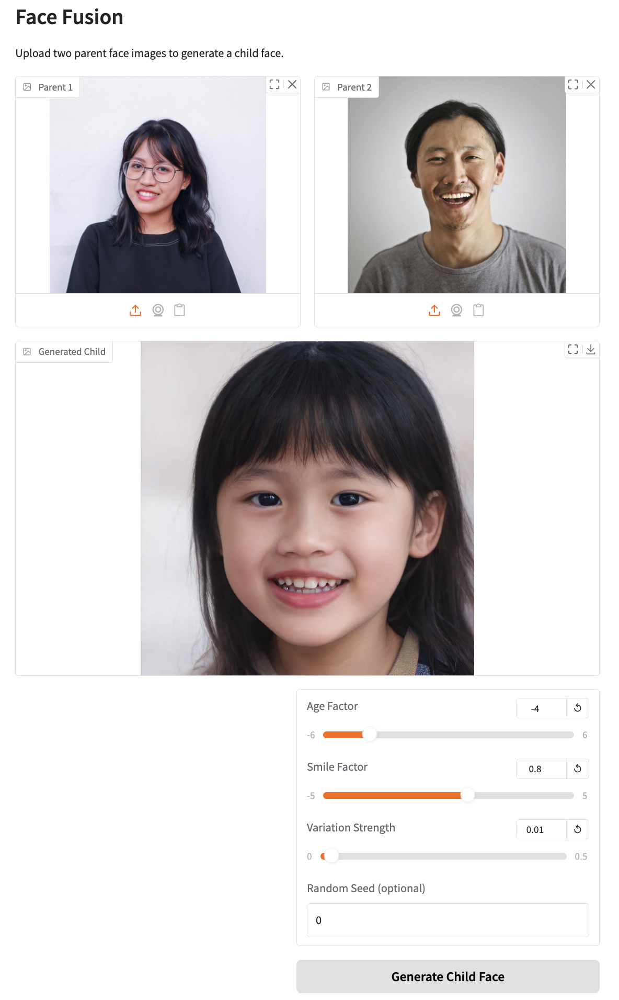

# Face Fusion StyleGAN2

A face manipulation and fusion project utilizing StyleGAN2 architecture for generating and blending facial features.

As a special use example, child face prediction is implemented with Gradio UI.

## Description

This project experiments face fusion techniques using StyleGAN2, allowing users to:
- Generate realistic fusion of two face images
- Adjust the age and smile of the generated image

## Models

- [StyleGAN2 ADA](https://github.com/NVlabs/stylegan2-ada-pytorch) [pre-trained models](https://nvlabs-fi-cdn.nvidia.com/stylegan2-ada-pytorch/pretrained/)
- [e4e encoder](https://github.com/omertov/encoder4editing) for latent space manipulation. [e4e pretrained models](https://github.com/omertov/encoder4editing?tab=readme-ov-file#pretrained-models)

## How to run it

- Download the repo to your Google Drive
- Upload the `face_fusion.ipynb` to [Google Colab](https://colab.research.google.com/)
- Turn on GPU usage in Colab. The free tier should work.
- In the first and second cells, edit the `project_dir` variables to be the actual path of the project folder
- Run the cells in order
